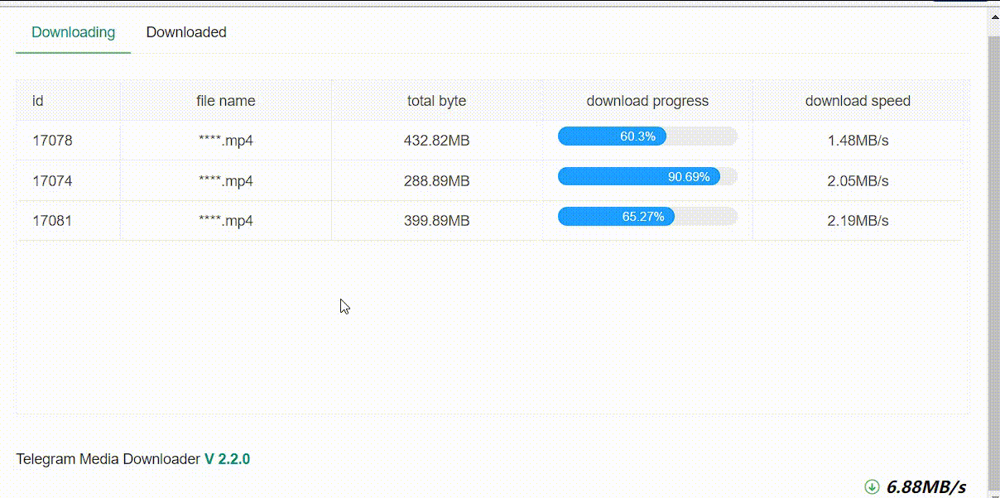
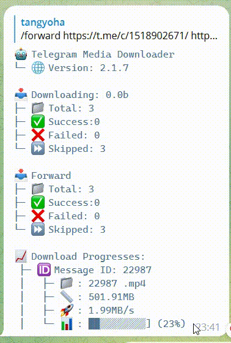

<h1 align="center">电报资源下载</h1>

<p align="center">
<a href="https://github.com/tangyoha/telegram_media_downloader/actions"></a>
<a href="https://codecov.io/gh/tangyoha/telegram_media_downloader"></a>
<a href="https://github.com/tangyoha/telegram_media_downloader/blob/master/LICENSE"></a>
<a href="https://github.com/python/black"></a>
<a href="https://github.com/tangyoha/telegram_media_downloader/releases">

</a>
</p>

<h3 align="center">
  <a href="./README.md">English</a><span> · </span>
  <a href="https://github.com/tangyoha/telegram_media_downloader/discussions/categories/ideas">新功能请求</a>
  <span> · </span>
  <a href="https://github.com/tangyoha/telegram_media_downloader/issues">报告bug</a>
  <span> · </span>
  帮助: <a href="https://github.com/tangyoha/telegram_media_downloader/discussions">讨论</a>
  <span> & </span>
  <a href="https://t.me/TeegramMediaDownload">电报讨论群</a>
</h3>

## 概述

> 支持两种默认运行

* 机器人运行，从机器人下发命令`下载`或者`转发`

* 作为一个一次性的下载工具下载

### 界面

#### 网页

> 运行后打开浏览器访问`localhost:5000`
> 如果是远程机器需要配置web_host: 0.0.0.0




### 机器人

> 需要配置bot_token,具体参考[文档](https://github.com/tangyoha/telegram_media_downloader/wiki/%E5%A6%82%E4%BD%95%E4%BD%BF%E7%94%A8%E6%9C%BA%E5%99%A8%E4%BA%BA%E4%B8%8B%E8%BD%BD)




### 支持

| 类别         | 支持                                     |
| ------------ | ---------------------------------------- |
| 语言         | `Python 3.7` 及以上                      |
| 下载媒体类型 | 音频、文档、照片、视频、video_note、语音 |

### 版本发布计划

* [v2.2.0](https://github.com/tangyoha/telegram_media_downloader/issues/2)

## 安装

对于具有 `make` 可用性的 *nix 操作系统发行版

```sh
git clone https://github.com/tangyoha/telegram_media_downloader.git
cd telegram_media_downloader
make install
```

对于没有内置 `make` 的 Windows

```sh
git clone https://github.com/tangyoha/telegram_media_downloader.git
cd telegram_media_downloader
pip3 install -r requirements.txt
```
## Docker容器
> 更详细安装教程请查看wiki

确保安装了 **docker** 和 **docker-compose**
```sh
docker pull tangyoha/telegram_media_downloader:latest
mkdir -p ~/app && mkdir -p ~/app/log/ && cd ~/app
wget https://raw.githubusercontent.com/tangyoha/telegram_media_downloader/blob/master/docker-compose.yaml -O docker-compose.yaml
wget https://raw.githubusercontent.com/tangyoha/telegram_media_downloader/blob/master/config.yaml -O config.yaml
wget https://raw.githubusercontent.com/tangyoha/telegram_media_downloader/blob/master/data.yaml -O data.yaml
# vi config.yaml and docker-compose.yaml
vi config.yaml

# 第一次需要前台启动
# 输入你的电话号码和密码，然后退出(ctrl + c)
docker-compose run --rm telegram_media_downloader

# 执行完以上操作后，后面的所有启动都在后台启动
docker-compose up -d

＃ 升级
docker pull tangyoha/telegram_media_downloader:latest
cd ~/app
docker-compose down
docker-compose up -d
```

## 升级安装

```sh
cd telegram_media_downloader
pip3 install -r requirements.txt
```

## 配置

所有配置都通过 config.yaml 文件传递​​给 `Telegram Media Downloader`。

**获取您的 API 密钥：**
第一步需要您获得有效的 Telegram API 密钥（API id/hash pair）：

1. 访问 [https://my.telegram.org/apps](https://my.telegram.org/apps) 并使用您的 Telegram 帐户登录。
2. 填写表格以注册新的 Telegram 应用程序。
3. 完成！ API 密钥由两部分组成：**api_id** 和**api_hash**。

**获取聊天ID：**
> 如果你需要下载收藏夹的内容请填`me`

**1。使用网络电报：**

1. 打开 <https://web.telegram.org/?legacy=1#/im>
2. 现在转到聊天/频道，您将看到 URL 类似

- `https://web.telegram.org/?legacy=1#/im?p=u853521067_2449618633394` 这里 `853521067` 是聊天 ID。
- `https://web.telegram.org/?legacy=1#/im?p=@somename` 这里的 `somename` 是聊天 ID。
- `https://web.telegram.org/?legacy=1#/im?p=s1301254321_6925449697188775560` 此处取 `1301254321` 并将 `-100` 添加到 id => `-1001301254321` 的开头。
- `https://web.telegram.org/?legacy=1#/im?p=c1301254321_6925449697188775560` 此处取 `1301254321` 并将 `-100` 添加到 id => `-1001301254321` 的开头。

**2。使用机器人：**
1.使用[@username_to_id_bot](https://t.me/username_to_id_bot)获取chat_id
    - 几乎所有电报用户：将用户名发送给机器人或将他们的消息转发给机器人
    - 任何聊天：发送聊天用户名或复制并发送其加入聊天链接到机器人
    - 公共或私人频道：与聊天相同，只需复制并发送给机器人
    - 任何电报机器人的 ID

### 配置文件

```yaml
api_hash: your_api_hash
api_id: your_api_id
bot_token: your_bot_token
chat:
- chat_id: telegram_chat_id
  last_read_message_id: 0
  download_filter: message_date >= 2022-12-01 00:00:00 and message_date <= 2023-01-17 00:00:00
- chat_id: telegram_chat_id_2
  last_read_message_id: 0
# 我们将ids_to_retry移到data.yaml
ids_to_retry: []
media_types:
- audio
- document
- photo
- video
- voice
- animation #gif
file_formats:
  audio:
  - all
  document:
  - pdf
  - epub
  video:
  - mp4
save_path: D:\telegram_media_downloader
file_path_prefix:
- chat_title
- media_datetime
upload_drive:
  enable_upload_file: true
  remote_dir: drive:/telegram
  before_upload_file_zip: True
  after_upload_file_delete: True
hide_file_name: true
file_name_prefix:
- message_id
- file_name
file_name_prefix_split: ' - '
max_download_task: 5
web_host: 127.0.0.1
web_port: 5000
web_login_secret: 123
allowed_user_ids:
- 'me'
date_format: '%Y_%m'
enable_download_txt: false
```

- **api_hash** - 你从电报应用程序获得的 api_hash
- **api_id** - 您从电报应用程序获得的 api_id
- **bot_token** - 你的机器人凭证
- **chat** -  多频道
  - `chat_id` -  您要下载媒体的聊天/频道的 ID。你从上述步骤中得到的。
  - `download_filter` - 下载过滤器, 查阅 [如何使用过滤器](https://github.com/tangyoha/telegram_media_downloader/wiki/%E5%A6%82%E4%BD%95%E4%BD%BF%E7%94%A8%E8%BF%87%E6%BB%A4%E5%99%A8)
  - `last_read_message_id` -如果这是您第一次阅读频道，请将其设置为“0”，或者如果您已经使用此脚本下载媒体，它将有一些数字，这些数字会在脚本成功执行后自动更新。不要改变它。
- **chat_id** - 您要下载媒体的聊天/频道的 ID。你从上述步骤中得到的。
- **last_read_message_id** - 如果这是您第一次阅读频道，请将其设置为“0”，或者如果您已经使用此脚本下载媒体，它将有一些数字，这些数字会在脚本成功执行后自动更新。不要改变它。
- **ids_to_retry** - `保持原样。`下载器脚本使用它来跟踪所有跳过的下载，以便在下次执行脚本时可以下载它。
- **media_types** - 要下载的媒体类型，您可以更新要下载的媒体类型，它可以是一种或任何可用类型。
- **file_formats** - 为支持的媒体类型（“音频”、“文档”和“视频”）下载的文件类型。默认格式为“all”，下载所有文件。
- **save_path** - 你想存储下载文件的根目录
- **file_path_prefix** - 存储文件子文件夹，列表的顺序不定，可以随机组合
  - `chat_title`      - 聊天频道或者群组标题, 如果找不到标题则为配置文件中的`chat_id`
  - `media_datetime`  - 资源的发布时间
  - `media_type`      - 资源类型，类型查阅 `media_types`
- **upload_drive** - 您可以将文件上传到云盘
  - `enable_upload_file` - [必填]启用上传文件，默认为`false`
  - `remote_dir` - [必填]你上传的地方
  - `upload_adapter` - [必填]上传文件适配器，可以为`rclone`,`aligo`。如果为`rclone`，则支持rclone所有支持上传的服务器，如果为aligo，则支持上传阿里云盘
  - `rclone_path`，如果配置`upload_adapter`为`rclone`则为必填，`rclone`的可执行目录，查阅 [如何使用rclone](https://github.com/tangyoha/telegram_media_downloader/wiki/Rclone)
  - `before_upload_file_zip` - 上传前压缩文件，默认为`false`
  - `after_upload_file_delete` - 上传成功后删除文件，默认为`false`
- **file_name_prefix** - 自定义文件名称,使用和 **file_path_prefix** 一样
  - `message_id` - 消息id
  - `file_name` - 文件名称（可能为空）
  - `caption` - 消息的标题（可能为空）
- **file_name_prefix_split** - 自定义文件名称分割符号，默认为` - `
- **max_download_task** - 最大任务下载任务个数，默认为5个。
- **hide_file_name** - 是否隐藏web界面文件名称，默认`false`
- **web_host** - web界面地址
- **web_port** - web界面端口
- **language** - 应用语言，默认为英文(`EN`),可选`ZH`（中文）,`RU`,`UA`
- **web_login_secret** - 网页登录密码，如果不配置则访问网页不需要登录
- **log_level** - 默认日志等级，请参阅 `logging._nameToLevel`
- **forward_limit** - 限制每分钟转发次数，默认为33，默认请不要修改该参数
- **allowed_user_ids** - 允许哪些人使用机器人，默认登录账号可以使用，带@的名称请加单引号
- **date_format** - 支持自定义配置file_path_prefix中media_datetime的格式，具体格式查看 [python-datetime](https://docs.python.org/zh-cn/3/library/time.html)
- **drop_no_audio_video** 由于telegram服务器不支持上传一组媒体的时候，上传没有音频的视频会报错，所以使用ffmpeg处理，如果不处理将该选项置为true，默认为false
- **enable_download_txt** 启用下载txt文件，默认`false`

## 执行

```sh
python3 media_downloader.py
```

所有下载的媒体都将存储在`save_path`根目录下。
具体位置参考如下：

```yaml
file_path_prefix:
  - chat_title
  - media_datetime
  - media_type
```

视频下载完整目录为：`save_path`/`chat_title`/`media_datetime`/`media_type`。
列表的顺序不定，可以随机组合。
如果配置为空，则所有文件保存在`save_path`下。

## 代理

该项目目前支持 socks4、socks5、http 代理。要使用它，请将以下内容添加到`config.yaml`文件的底部

```yaml
proxy:
  scheme: socks5
  hostname: 127.0.0.1
  port: 1234
  username: 你的用户名（无则删除该行）
  password: 你的密码（无则删除该行）
```

如果您的代理不需要授权，您可以省略用户名和密码。然后代理将自动启用。

## 贡献

### 贡献指南

通读我们的[贡献指南](./CONTRIBUTING.md)，了解我们的提交流程、编码规则等。

### 想帮忙？

想要提交错误、贡献一些代码或改进文档？出色的！阅读我们的 [贡献指南](./CONTRIBUTING.md)。

### 行为守则

帮助我们保持 Telegram Media Downloader 的开放性和包容性。请阅读并遵守我们的[行为准则](./CODE_OF_CONDUCT.md)。


### 赞助

<p>


</p>
